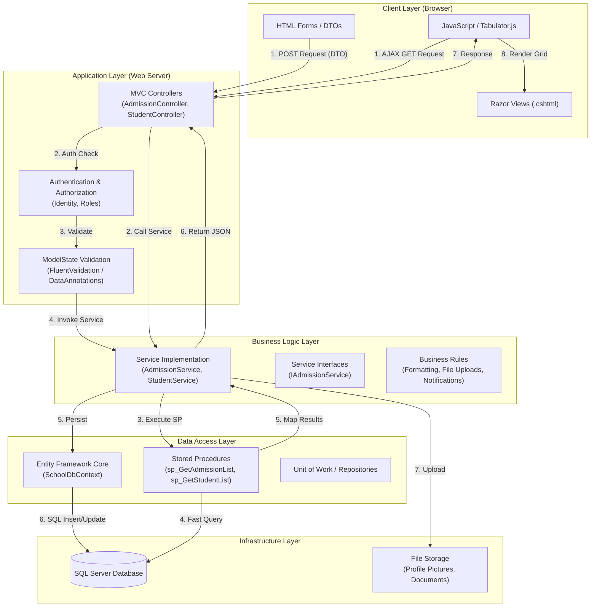

# School Management System: Data Flow Architecture

This document provides a comprehensive overview of how data flows through the School Management System (SchoolMS). The architecture follows a standard **ASP.NET Core MVC** pattern enhanced with a **Service-Repository** layer and high-performance **Stored Procedures** for data retrieval.

## 1. High-Level Data Flow Diagram (DFD)

The following diagram illustrates the lifecycle of a request, using the **Admission Application** and **Student Management** modules as primary examples.

---

## 2. Detailed Component Breakdown

### A. Client Layer (Presentation)
*   **Razor Views**: Server-side rendered HTML that provides the initial structure and SEO-friendly content.
*   **Tabulator.js**: A high-performance interactive table used for all administrative dashboards. It handles server-side pagination, filtering, and sorting by sending AJAX requests to the controllers.
*   **DTOs (Data Transfer Objects)**: Specialized models (e.g., `AdmissionCreateDto`) used to transport data from the form to the server, ensuring only necessary data is exposed and accepted.

### B. Controller Layer (Coordination)
The Controller acts as the traffic cop:
1.  **Routing**: Routes incoming HTTP requests to specific actions.
2.  **Authorization**: Ensures the user has the correct role (e.g., `[Authorize(Roles = "Admin")]`).
3.  **Model Binding**: Automatically maps JSON or Form data into C# objects (DTOs).
4.  **Result Mapping**: Decides whether to return a View (for page loads) or JSON (for AJAX/Tabulator).

### C. Service Layer (Business Logic)
This is where the "heavy lifting" happens. By separating logic from controllers, the code remains testable and reusable.
*   **Abstraction**: Controllers interact with interfaces (e.g., `IAdmissionService`), allowing implementation details to change without affecting the UI.
*   **Workflows**: For example, when an admission is approved, the `AdmissionService` handles:
    *   Updating the application status.
    *   Creating a new `Student` record.
    *   Mapping data from the application to the student entity.
    *   Handling file transfers (moving profile pictures).

### D. Data Access Layer (Persistence)
*   **EF Core (SchoolDbContext)**: Used for standard CRUD operations (Create, Read, Update, Delete) where ease of development and change tracking are prioritized.
*   **Stored Procedures (SPs)**: Used for complex Read operations. SPs like `sp_GetAdmissionList` are highly optimized for:
    *   Joining multiple tables (Classes, Sections, Results).
    *   Performing server-side pagination and complex filtering.
    *   Returning summarized counts (e.g., "Pending: 5, Approved: 10") in a single database round-trip.

---

## 3. Example Sequence: Admission Approval

1.  **User Action**: Admin clicks "Approve" on a pending admission in the Tabulator grid.
2.  **Request**: JavaScript sends a `POST` request to `/Admission/Approve` with the `AdmissionId` and `SectionId`.
3.  **Validation**: `AdmissionController` validates the anti-forgery token and user permissions.
4.  **Service Call**: `AdmissionService.ApproveAndConvertAsync()` is invoked.
5.  **Transaction**: 
    *   The service starts a database transaction.
    *   It retrieves the `AdmissionApplication` entity.
    *   It checks the `Section` capacity to ensure it's not full.
    *   It creates a new `Student` entity, assigning a generated `StudentRoll` and `StudentNumber`.
    *   It marks the application as `Approved`.
6.  **Persistence**: `DbContext.SaveChangesAsync()` commits all changes to the SQL database.
7.  **Response**: Controller returns a JSON success message.
8.  **UI Refresh**: JavaScript triggers a `table.setData()` to refresh the grid without a page reload.

---

## 4. Key Security & Integrity Patterns
*   **Anti-Forgery**: All POST requests are protected by `[ValidateAntiForgeryToken]`.
*   **Soft Deletes**: Entities use an `IsDeleted` flag instead of hard-deleting records, preserving audit trails.
*   **Audit Logging**: The system captures `CreatedBy`, `CreatedAt`, `UpdatedBy`, and `UpdatedAt` for every record change.
*   **Transaction Safety**: Complex multi-step operations (like converting an applicant to a student) are wrapped in transactions to prevent partial data corruption.
