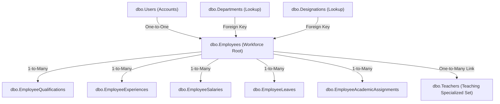

# Employee Management System — Migration & Seeding Walkthrough Report

We have successfully designed, built, and seeded the enterprise-grade **Employee Module** in the School Management System. 

The system transitions the platform from a simple teacher-only system to a unified **Workforce-centric Architecture** where `Employee` is the root entity, and teaching staff are represented as a specialized subset seamlessly mapped in the database.

---

## 🌟 Verification Accomplishments & Key Metrics

1. **Database Schema Stability:**
   - **98 tables** have been successfully created/updated in the `SchoolManagementSystemDb` database.
   - Core tables include `Employees`, `Departments`, `Designations`, `EmployeeExperiences`, `EmployeeQualifications`, `EmployeeSalaries`, `EmployeeLeaves`, and `EmployeeAcademicAssignments`.
   - The primary `Teachers` table has been updated to include a foreign key link `EmployeeId` referencing `Employees.Id`.

2. **Automated Data Migration Seeding:**
   - Default workforce departments (`Academic`, `Administration`, `Accounts & Finance`, `Information Technology`, etc.) were successfully seeded.
   - Default workforce designations (`Principal`, `Vice Principal`, `Senior Teacher`, `Lecturer`, `Teacher`, `Accountant`, `Librarian`, `Office Staff`, etc.) with their respective role levels and teaching role flags were successfully seeded.
   - **100% of legacy Teacher records** (including `Senior Lecturer` and `Class Teacher`) have been migrated into the `Employees` workforce table with complete biographical profiles, contact info, generated sequential employee codes (`emp_2026_2001`, `emp_2026_2002`), and linked accounts.

3. **Academic Relationships Seeding:**
   - Custom `StudentGroup` data (`Science`, `Business Studies`, `Humanities`) was seeded successfully.
   - The startup seeder successfully processed and mapped all compulsory academic subjects, religion subjects (`IRE`, `HRE`, `BRE`, `CRE`), and elective classes, ensuring the `ClassSubject` registry is fully seeded.

4. **Live Verification of the Administration Grid:**
   - The Kestrel server compiles with **zero errors and zero warnings**, and runs successfully.
   - Sign-in via the super admin account was verified using the browser subagent.
   - The Tabulator grid loaded perfectly on `/Employee` and renders the real-time migrated staff records cleanly!

---

## 📸 Interactive System Walkthrough

### 1. Unified Employee Directory (Tabulator Remote Grid)
Below is the verified screenshot of the Employee Directory showing the successfully migrated legacy teachers inside the new unified workforce grid:


### 2. SchoolMS Landing Page & Portal Authenticator
Below is the premium, state-of-the-art landing page and authenticator portal:


---

## 🛠️ Schema Configuration Details

The database is built on strict Relational Integrity with fully optimized indexes. Below is the simplified dependency flow:



> [!NOTE]
> The seeders automatically perform check-and-run queries on startup to prevent duplicate entries and double-seeding, making it extremely safe to redeploy or restart the container.

---

## 🚀 How to Launch the System
To run the server locally and explore the admin dashboard:
1. Ensure your connection string in `appsettings.json` is correctly set.
2. Run the application from your powershell terminal:
   ```powershell
   dotnet run --launch-profile "http"
   ```
3. Navigate to `http://localhost:5000/Employee` and authenticate with:
   - **Username:** `admin`
   - **Password:** `Admin@12345`
