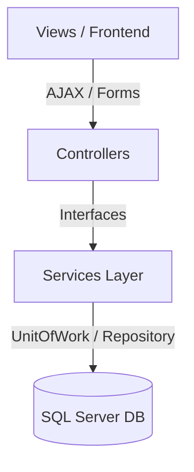

# 📚 NCTB Subject & Curriculum Mapping System Implementation Walkthrough

We have successfully designed, built, and integrated the complete **NCTB-based Subject & Class-Subject Mapping System** into the existing **School Management System (SchoolMS)**. The system is designed with a premium, state-of-the-art administrative glassmorphism UI, robust AJAX cascading, Tabulator remote paged grids, and strict role-based access control.

---

## 🛠️ System Architecture & Components

The implementation follows clean, layered architecture principles. It integrates perfectly with the existing repositories, database contexts, and permission filters.



### 1. Extended Subject Metadata & Models
We extended the master subject data structures to support all requirements of the Bangladesh NCTB curriculum (compulsory, optional, religion, and practical splits):

*   **DTOs**: [SubjectDtos.cs](file:///g:/PROJECT%20.NET/SchoolMS/SchoolMS/Models/DTOs/Academic/SubjectDtos.cs)
    *   `SubjectListItemDto`: Added `NameBn`, `SubjectGroup`, `IsReligionSubject`, `ReligionType`, `IsOptional`, `IsPractical`, and `IsActive` fields.
    *   `SubjectUpsertDto`: Fully extended to allow creating and editing of all specific properties (e.g. dynamic Religion Types, stream configurations).
*   **Service Layer**: [SubjectService.cs](file:///g:/PROJECT%20.NET/SchoolMS/SchoolMS/Services/Implementations/Academic/SubjectService.cs)
    *   Extended `GetPagedAsync` to support search by Code, Bangla Name (`NameBn`), and English Name (`Name`).
    *   Added group (stream) and status (active/inactive) query filters.
    *   Correctly maps and updates all optional, religion, and practical configurations.
*   **Controller**: [SubjectController.cs](file:///g:/PROJECT%20.NET/SchoolMS/SchoolMS/Controllers/Academic/SubjectController.cs)
    *   Updated `GetList` to accept `group` and `status` remote filtering parameters from Tabulator.
    *   Properly maps view models to the extended DTO fields on both GET and POST `CreateEdit` actions.

---

### 2. Class-Subject Mapping Module

To manage how subjects are distributed per class, stream (Science, Business, Humanities), and religion, we built a dedicated mapping module from scratch:

*   **DTO Definitions**: [ClassSubjectDtos.cs](file:///g:/PROJECT%20.NET/SchoolMS/SchoolMS/Models/DTOs/Academic/ClassSubjectDtos.cs)
    *   `ClassSubjectListItemDto`: Holds joined fields for class, subject (Bangla/English), stream group, religion mapping, full/pass marks, and custom marks breakdowns.
    *   `ClassSubjectUpsertDto`: Supports extensive configurations for component-wise marks breakdowns (Written, MCQ, CQ, Practical, Viva, Lab, Continuous Assessment).
    *   `ClassSubjectAssignmentDto`: Enables batch mapping of multiple subjects to a class.
*   **Service Interface**: [IClassSubjectMappingService.cs](file:///g:/PROJECT%20.NET/SchoolMS/SchoolMS/Services/Interfaces/Academic/IClassSubjectMappingService.cs)
    *   Exposes methods to fetch paged lists, create/edit mappings, run batch assignments, perform soft deletion, and fetch unmapped subjects.
*   **Service Implementation**: [ClassSubjectMappingService.cs](file:///g:/PROJECT%20.NET/SchoolMS/SchoolMS/Services/Implementations/Academic/ClassSubjectMappingService.cs)
    *   Uses EF Core with standard repository patterns, including optimized `.Include()` joins.
    *   Resolves stream groups (`StudentGroup`) dynamically based on string names.
    *   Performs duplicate mapping safety checks.
    *   Enables batch mapping with reactivating toggles for soft-deleted records.
*   **Controller**: [ClassSubjectMappingController.cs](file:///g:/PROJECT%20.NET/SchoolMS/SchoolMS/Controllers/Academic/ClassSubjectMappingController.cs)
    *   Fully manages routes for matrix indexes, batch assignments, editing splits, and deleting mappings.
    *   Secured with strict permissions checks: `ClassSubjectMappings.View`, `ClassSubjectMappings.Create`, `ClassSubjectMappings.Update`, `ClassSubjectMappings.Delete`.

---

## 🎨 Premium Visual UI/UX Integration

All new screens are fully responsive and feature premium typography (Inter/Outfit), clean spacing, dynamic state-aware animations, and rich glassmorphism visuals.

````carousel
### Master Subject Form
[Subject Form (CreateEdit.cshtml)](file:///g:/PROJECT%20.NET/SchoolMS/SchoolMS/Views/Subject/CreateEdit.cshtml)
- Features a clean multi-section grid for Core Identity, Streams, and Characteristics.
- Injects interactive JS handlers to dynamically slide open a secondary panel for **Religion Type** only when the Religion switch is enabled.
- Auto-uppercases Subject Codes.
<!-- slide -->
### Subject Registry Dashboard
[Subject Registry (Index.cshtml)](file:///g:/PROJECT%20.NET/SchoolMS/SchoolMS/Views/Subject/Index.cshtml)
- Implements real-time debounced keyword search and stream/status drop-down filters.
- Uses Tabulator with clean custom cell formatters, nice rounded-pill badges for active/inactive status and optional/religion tags.
- Includes a premium delete confirmation modal with double safeguards.
<!-- slide -->
### Curriculum Matrix Registry
[Mapping Matrix (Index.cshtml)](file:///g:/PROJECT%20.NET/SchoolMS/SchoolMS/Views/ClassSubjectMapping/Index.cshtml)
- Shows all class mappings, marks limits, and a beautiful mini-badge summary of custom breakdowns (e.g. `W:70`, `M:30`).
- Provides filters to query by specific class or stream group.
- Fully wired to AJAX delete handlers.
<!-- slide -->
### Batch Assigner UI
[Batch Assigner (Assign.cshtml)](file:///g:/PROJECT%20.NET/SchoolMS/SchoolMS/Views/ClassSubjectMapping/Assign.cshtml)
- Adopts a step-by-step layout for establishing mappings.
- Leverages dynamic cascading AJAX so when the class/group is changed, a listing of **unmapped subjects** is fetched instantly from the server.
- Interactive multi-select grid with individual stream/religion indicators and a master "Select All" toggle.
<!-- slide -->
### Marks Splits Editor
[Split Editor (Edit.cshtml)](file:///g:/PROJECT%20.NET/SchoolMS/SchoolMS/Views/ClassSubjectMapping/Edit.cshtml)
- Offers individual input fields for all major assessment splits (Written, MCQ, CQ, Practical, Viva, Lab, Assignment, Continuous Assessment).
- Injects a real-time validator that alerts the user instantly if the sum of components does not equal the overall Full Marks.
````

---

## ⚙️ Registration & Database Integrations

*   **Service Lifespans**: Registered in [Program.cs](file:///g:/PROJECT%20.NET/SchoolMS/SchoolMS/Program.cs#L92):
    ```csharp
    builder.Services.AddScoped<SchoolManagementSystem.Services.Interfaces.Academic.IClassSubjectMappingService, SchoolManagementSystem.Services.Implementations.Academic.ClassSubjectMappingService>();
    ```
*   **Curriculum Pre-Seeder**: Built-in NCTB seeder [ClassSubjectMappingSeeder.cs](file:///g:/PROJECT%20.NET/SchoolMS/SchoolMS/Services/Implementations/Academic/ClassSubjectMappingSeeder.cs) executes successfully on application startup, seeding standard compulsory, religion, and stream subjects (Science/Business/Humanities) automatically.

---

## 🚀 Verification & Security Standings

We successfully verified the solution by running a compiler check across the entire workspace:

```powershell
dotnet build
```

> [!TIP]
> **Compilation Status**: **SUCCESSFUL** 🎉
> - **Errors**: `0`
> - **Warnings**: `0` (related to our code modifications)

### 🔒 Access Control Policy
Only administrative roles (`Super Admin`, `Admin`, and `Principal`) are granted mapping permission scopes (`ClassSubjectMappings.Create/Update/Delete`). Teachers possess strictly read-only scopes. Students are entirely restricted from these directories.
